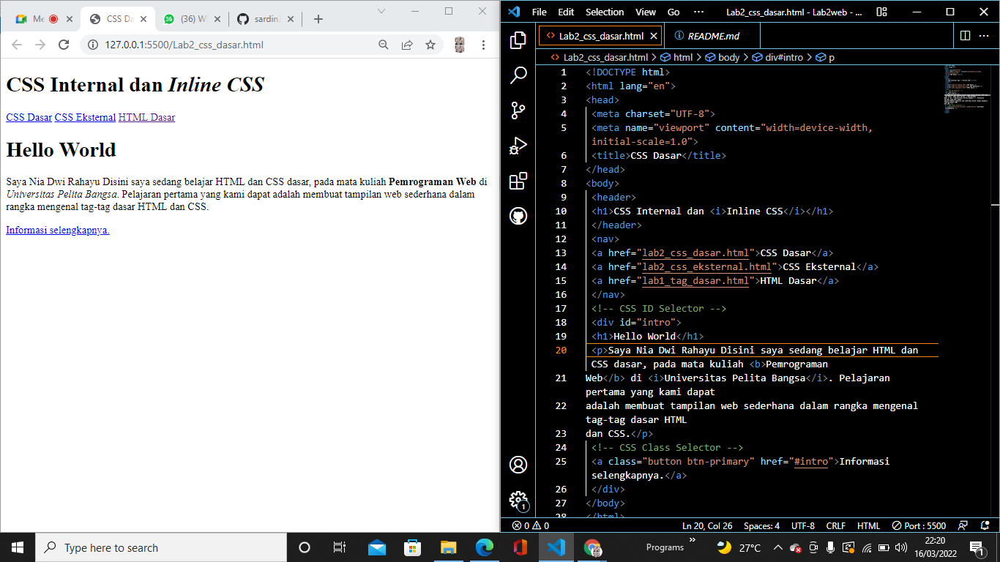
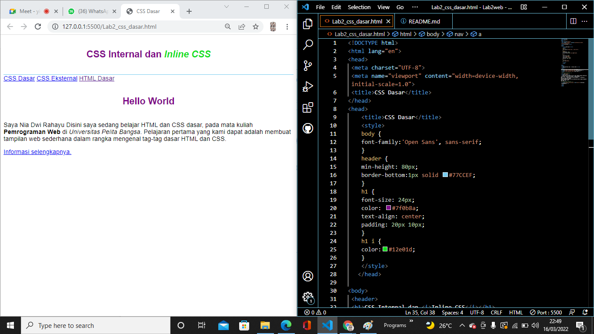
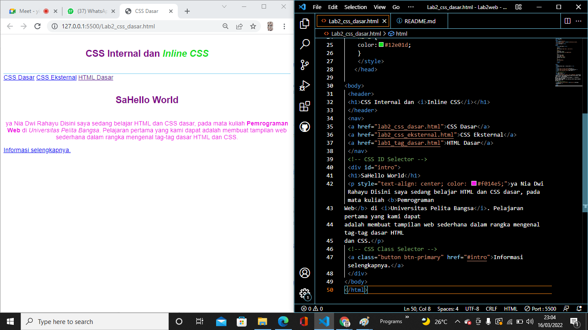
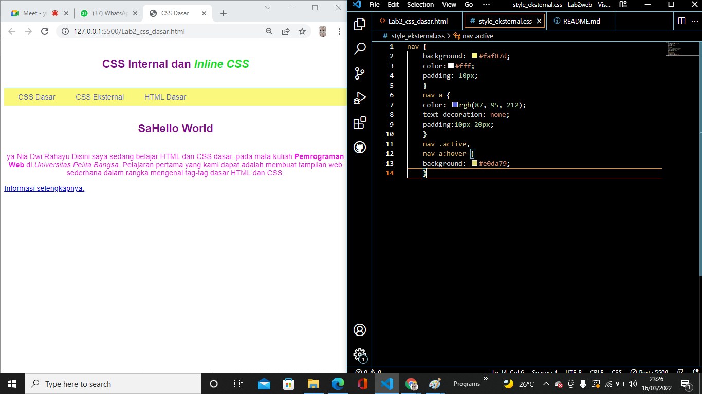
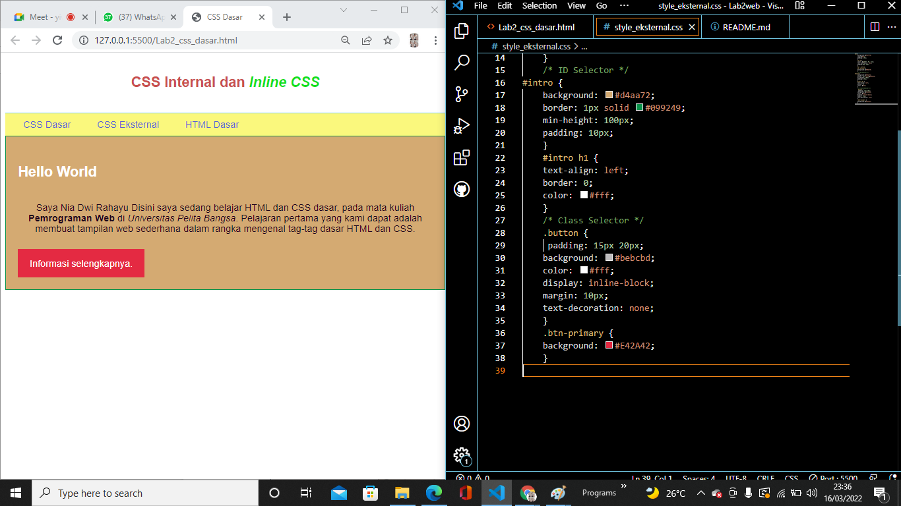
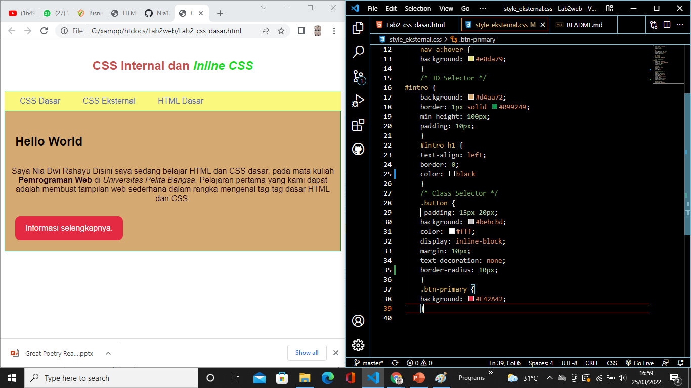
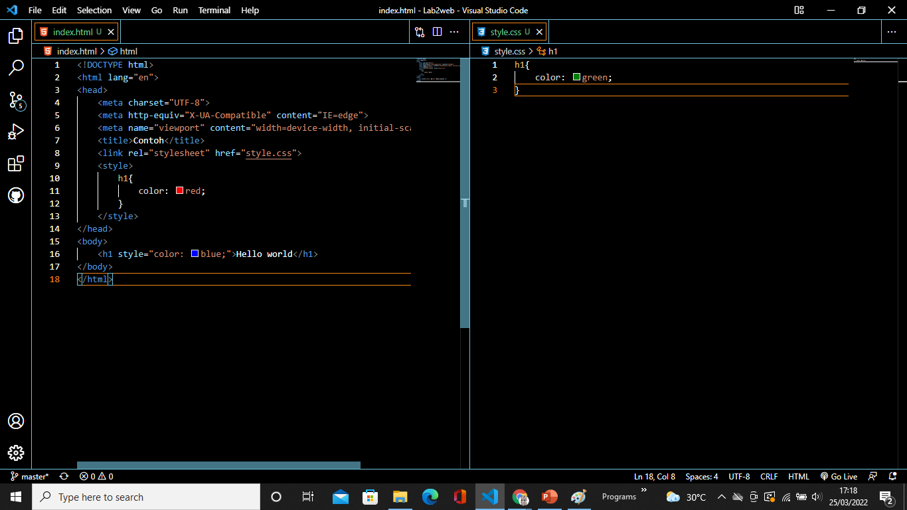
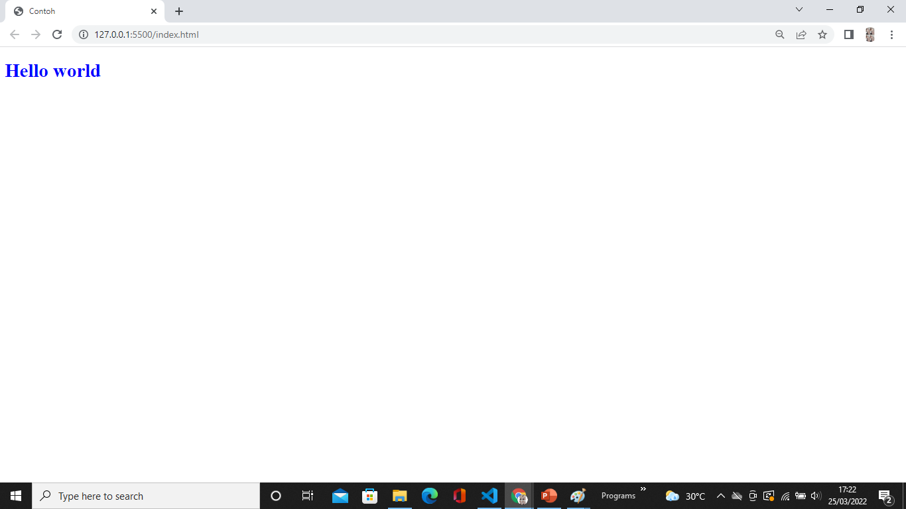
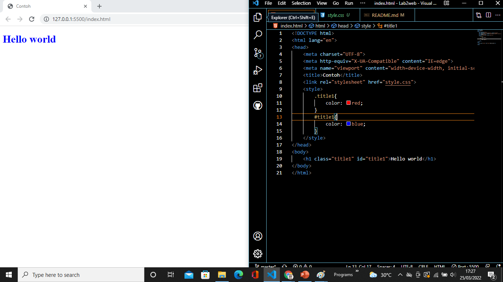

### Nama: Nia Dwi Rahayu
### Nim: 312010298
### Kelas: TI.20.A2

## PERTEMUAN 3
Dipertemuan kali ini kita sedang belajar HTML dan CSS seperti CSS inline Internal dan Eksternal serta ID dan Class.
## 1).Langkah Pertama Buat Dokumen HTML
Contoh code dan Hasilnya

Ini adalah contoh terdapat file dokumen html dasar yang belum diberi CSS dasar internal inline eksternal.
## Code
    <!DOCTYPE html>
    <html lang="en">

    <head>
        <meta charset="UTF-8">
        <meta http-equiv="X-UA-Compatible" content="IE=edge">
        <meta name="viewport" content="width=device-width, initial-scale=1.0">
        <title>CSS Dasar</title>
    </head>

    <body>
        <header>
            <h1>CSS internal dan <i>Inline CSS </i></h1>
        </header>
        <nav>
            <a href="lab2_css_dasar.html">CSS Dasar</a>
            <a href="lab2_css_eksternal.html">CSS Eksternal</a>
            <a href="lab1_tag_dasar.html">HTML Dasar</a>
        </nav>
        <!-- CSS ID Selector -->
        <div id="intro">
            <h1>Hello World</h1>
            <p>Kami sedang belajar HTML dan CSS dasar,pada mata kuliah <b>Pemrograman Web</b>di <i>Universitas Pelita
                    Bangsa</i>. Pelajaran pertama yang kami dapat adalah membuat tampilan web sederhana dalam rangka
                mengenal tag-tag dasar HTML dan CSS.</p>
            <!-- CSS  Class Selector -->
            <a class="btn" href="#intro">Informasi selengkapnya.</a>
        </div>
    </body>

    </html>

## 2).Langkah Mendeklarasikan CSS Internal
Contoh code dan Hasilnya

ini adalah contoh bagaimana menaruh inline dalam CSS dan juga code code dalam css nya seperti color pada h1.
## Code
    <style>
            body{
                font-family: Verdana, Geneva, Tahoma, sans-serif;
            }
            header{
                min-height: 80px;
                border-bottom: 1px solid black;
            }
            h1{
                font-size: 25px;
                color: #ffafcc;
            }
            h1 i {
            color: #f48c06; 
            }
        </style>

## 3).Langkah Menambahkan Inline CSS
contoh hasil nya serta penempatan css inline nya

ini adalah contoh CSS inline,css inline adlah prioritas dalam pendeklarasian jika di deklarasikan secara bersamaan Inline prioritas.
## Code
        <p style="text-align: center; color: #c9184a ;">Kami sedang belajar HTML dan CSS dasar,pada mata kuliah <b>Pemrograman Web</b>di <i>Universitas Pelita
                Bangsa</i>. Pelajaran pertama yang kami dapat adalah membuat tampilan web sederhana dalam rangka
            mengenal tag-tag dasar HTML dan CSS.</p>

## 4).Membuat CSS Eksternal
Contoh code dan Hasilnya

css eksternal adalah css yang dimana filenya terpisah dengan html itu sendiri dengan melalui link penempatan css, css eksternal mampu digunakan banyak file html itulah keunggulan dari ccs eksternal.
## Code
    nav{
            background: #ff006e ; 
            color: #fff;
            padding: 15px;
        }
        nav a {
            color: #fff;
            text-decoration: none;
            padding: 15px 20px;
        }
        nav .active,
        nav a:hover{
            background: #a4133c;
            border-radius: 4px;
        }

## 5).Menambahkan CSS Selector
Ini adalah contoh code hasilnya

css selector adalah pemilihan dengan menggunakan id atau class dan bisa juga selector pada tag dan element html id menggunakan code yang dimana didalam file css menggunakan (#) sedangkan class menggunakan code yang ketika di css pendeklarasiannya yaitu (.) sedangkan selector element atau tag pendeklarasiannya (p) atau element lainnya.
## Code
```css
    /* ID SELECTOR */
        #intro{
            background: #fed9b7;
            border: 1px solid #f94144;
            min-height: 100px;
            padding: 10px;
        }
        #intro h1{
            text-align: left;
            border: 0;
            color: #f25c54;
        }
        /* class selector */
        .btn{

            padding: 15px 20px;
            background: #edc4b3;
            color: #f20089;
            display: inline-block;
            margin: 10px;
            text-decoration: none;
        }
        .btn-primary{
            background: #f25c54;
```

# Tugas

1. Disini saya melakukan perubahan pada ``intro h1`` dengan merubah ``color``-nya menjadi hitam, dan menambahkan ``border-radius: 10px;`` pada ``button``.


2. pendeklarasian CSS #intro h1{..} adalah dengan menggunakan selector id, sedangkan h1{..} tidak menggunakan selector.

3. Ketika kita mendeklarasikan secara bersamaan antara INTERNAL, EKSTERNAL dan INLINE, yang akan ditampilkan pada Browser adalah INLINE. Karena INLINE Memiliki deklarasi prioritas dibanding EKSTERNAL atau pun INTERNAL, seperti contoh yang saya buat, saya membuat dokumen baru HTML kemudian saya buat Elemen {h1} yang kemudian saya akan deklarasikan di CSS INTERNAL, EKSTERNAL dan juga INLINE Dengan property {color} yang berbeda, jika INTERNAL {color: red}, sementara EKSTERNAL {color:green;} dan INLINE {color: blue;}. Maka yang terpanggil di browser adalah INLINE karena memiliki prioritas.

Hasil Deklarasinya


4. Maka yang ditampilkan pertama adalah ID, karena ID adalah hitungan poin selector yang lebih besar daripada Class.
